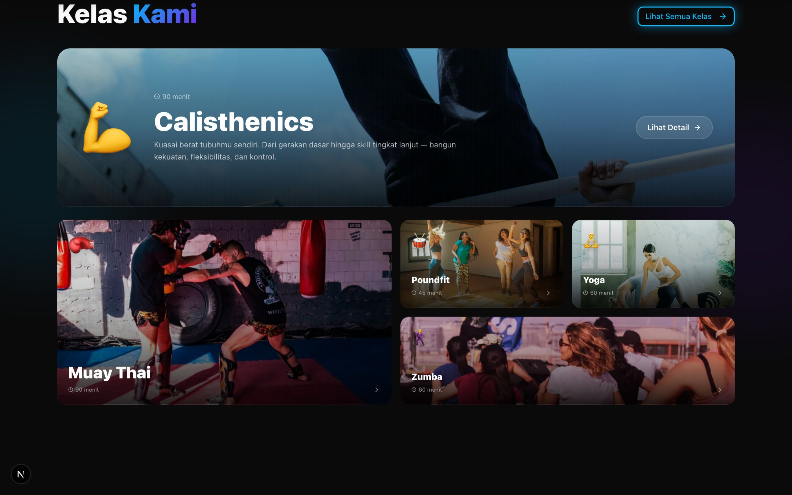
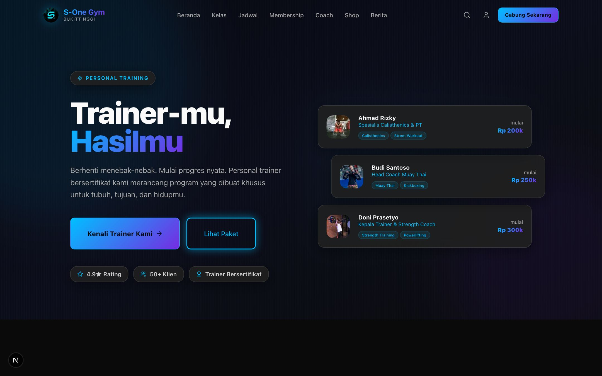
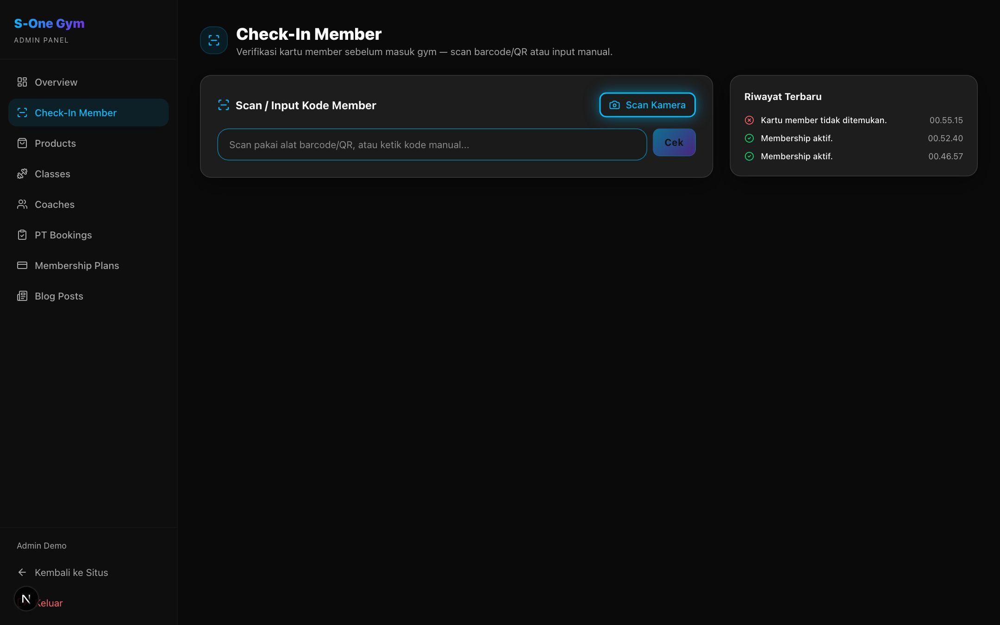

<div align="center">

# S-One Gym — Full-Stack Gym Management Platform

Aplikasi web full-stack untuk gym fiktif di Bukittinggi: situs publik editorial, akun member, panel admin CMS, dan verifikasi akses berbasis QR/barcode — dibangun dari nol dengan Next.js 15, Prisma, dan PostgreSQL. Bukan sekadar UI mock-up — setiap alur (registrasi, pembayaran lewat Midtrans Snap, booking, ulasan, notifikasi, check-in gym) benar-benar tersambung ke database.


</div>


## Overview

S-One Gym adalah aplikasi manajemen gym full-stack yang mencakup empat sisi sekaligus:

- **Situs publik** — landing page editorial dengan foto asli & micro-interaction (Framer Motion), katalog kelas, jadwal mingguan, profil coach, paket membership, toko produk, dan blog/news, sepenuhnya berbahasa Indonesia, dengan SEO lengkap (sitemap, robots.txt, JSON-LD, metadata per halaman).
- **Area member** — registrasi & login sungguhan (Credentials + Google OAuth), verifikasi email lewat kode OTP, dashboard dengan kartu member ber-**QR code & barcode asli** (bisa benar-benar di-scan), pembayaran nyata lewat **Midtrans Snap**, dan alur pembelian nyata: beli produk, booking kelas, booking personal trainer, langganan membership — semuanya menulis baris asli ke database, bukan simulasi tampilan.
- **Panel admin (CMS)** — dilindungi role-based access control di level middleware **dan** server action, dipakai untuk mengelola seluruh konten publik langsung dari browser, plus halaman **check-in member** untuk verifikasi kartu (scan kamera atau alat scanner fisik) sebelum masuk gym.
- **Keamanan & integritas data** — RLS aktif di seluruh tabel, dan aturan bisnis membership yang mencegah member menimpa sisa masa aktif paket lamanya saat membeli paket lain.

Setelah alur inti berjalan, ditambahkan sistem **ulasan** (produk, kelas, paket PT) yang otomatis memicu rating produk & testimoni homepage yang riil, serta sistem **notifikasi** nyata yang dipicu oleh event asli (booking, pembayaran, dsb).

Project ini sengaja dibangun bertahap — dari static mock UI, ke aplikasi full-stack yang benar-benar tersambung ke database, ke integrasi payment gateway sungguhan, sampai ke audit keamanan produksi — termasuk menemukan dan memperbaiki cukup banyak bug non-trivial di sepanjang jalan (lihat [Engineering Highlights](#engineering-highlights) di bawah).

## Fitur Utama

### Publik
- Homepage dengan section dinamis (kelas unggulan, coach unggulan, artikel terbaru, **testimoni asli** dari ulasan member) yang otomatis menyesuaikan jumlah data
- Layout editorial — bento grid, hero foto full-bleed, animated counter, parallax section — bukan sekadar tumpukan card seragam
- Katalog kelas dengan foto asli per kelas + konten cerita/narasi di tiap halaman detail kelas, jadwal mingguan dengan filter hari + tipe kelas
- Direktori coach dengan foto asli & halaman detail bergaya editorial, plus alur booking Personal Trainer
- Paket membership dengan tabel perbandingan fitur
- Toko produk dengan keranjang belanja, rating produk **dihitung otomatis** dari ulasan pembeli (bukan input manual admin)
- Blog/News dengan halaman detail artikel
- SEO teknikal: `sitemap.xml` & `robots.txt` dinamis, JSON-LD (`ExerciseGym`, `Article`), metadata + canonical URL per halaman

### Autentikasi & Member
- **NextAuth v5**: login Credentials (`bcrypt-ts`) + **Google OAuth**
- **Verifikasi email lewat kode OTP** (6 digit, dikirim via Gmail SMTP/Nodemailer) — akun belum terverifikasi tidak bisa checkout, booking kelas, atau booking PT sampai kode dimasukkan
- Middleware + server-side guard (`requireVerifiedUser`) sebagai dua lapis proteksi rute
- Dashboard member: kartu member dengan **QR code & barcode Code128 yang benar-benar bisa di-scan** (di-generate server-side lewat `bwip-js`, bukan pola dekoratif), status membership aktif, statistik nyata (kelas dihadiri, sisa hari, kelas mendatang), riwayat transaksi gabungan (produk + kelas + PT)
- Halaman Settings: ubah profil & password (dengan verifikasi password lama), hapus akun (cascade aman)

### Transaksi Nyata — Midtrans Snap
- **Checkout produk**, **booking kelas**, **booking Personal Trainer**, dan **langganan membership** semuanya diproses lewat **Midtrans Snap** sungguhan (bukan mock UI) — satu model `PaymentIntent` generik menampung payload tiap jenis transaksi sebelum dikonfirmasi
- Konfirmasi pembayaran punya **dua jalur yang saling menguatkan**: polling aktif dari halaman `/payment/processing` ke Midtrans Core API, **dan** webhook `POST /api/midtrans/notification` — keduanya memanggil fungsi fulfillment yang sama dan idempoten, jadi tidak mungkin data ganda kalau kedua jalur kebetulan datang bersamaan
- Setelah pembayaran sukses: checkout produk menulis `Order`+`OrderItem`+`Payment` lalu memicu prompt ulasan; booking kelas menulis `ClassRegistration` dan otomatis ditandai "sudah dihadiri" setelah jam kelas lewat; booking PT menulis `PTBooking`; langganan membership menulis `GymMembership` dan menerbitkan `MemberCard` baru
- **Aturan konflik paket membership**: kalau member masih punya membership aktif (paket apa pun), sistem menolak pembelian paket baru di level server action — bukan cuma di UI — supaya sisa masa aktif paket lama tidak pernah tertimpa diam-diam (lihat cerita bug-nya di [Engineering Highlights](#engineering-highlights))

### Check-In & Akses Gym
- Kartu member menampilkan **QR code & barcode Code128 asli** (`bwip-js`), bukan pola visual dekoratif — sudah diverifikasi lewat uji generate-lalu-decode-ulang
- Halaman admin **Check-In Member** (`/admin/check-in`) untuk verifikasi sebelum masuk gym: scan pakai kamera device (`jsqr`) atau alat scanner fisik/keyboard-wedge, langsung menampilkan status AKTIF/DITOLAK beserta info member
- Setiap percobaan scan (valid maupun tidak) dicatat ke tabel `MemberCheckIn` sebagai riwayat akses — fondasi yang bisa dihubungkan ke sistem pintu otomatis (IoT) di kemudian hari

### Ulasan & Notifikasi
- Satu model `Review` menangani tiga jenis target (produk, sesi kelas, paket PT) dengan constraint database yang memastikan tepat satu target terisi per ulasan
- Rating produk & testimoni homepage dihitung otomatis dari ulasan asli — bukan angka yang diketik manual
- Notifikasi asli (bukan data dummy) untuk konfirmasi booking, pembayaran berhasil, paket PT aktif, dan pengingat beri ulasan — muncul konsisten di dropdown header maupun halaman `/notifications`

### Admin CMS
- Login admin dengan role terpisah (`ADMIN` vs `USER`), dijaga di middleware **dan** setiap server action
- CRUD penuh untuk **Products**, **Classes**, **Coaches**, **Membership Plans**, dan **Blog Posts** lewat **Next.js Server Actions**
- Rating produk bersifat read-only di form admin (dihitung otomatis dari ulasan pelanggan)
- Tracking sesi Personal Training (**PT Bookings**) dan verifikasi akses member (**Check-In**)

### Keamanan
- **Row Level Security (RLS) aktif di seluruh tabel** — ditemukan lewat audit Supabase Security Advisor bahwa API publik (`/rest/v1/...`) sempat bisa diakses siapa saja dengan anon key, termasuk tabel `User` (password hash) dan `Account` (OAuth token). Sudah diperbaiki tanpa mengubah kode aplikasi sama sekali (Prisma tetap jalan sebagai table owner, RLS hanya menutup akses publik).
- Signature verification untuk webhook Midtrans (SHA512 dari `order_id+status_code+gross_amount+server_key`) supaya notifikasi palsu tidak bisa memicu fulfillment

## Engineering Highlights

Beberapa keputusan & perbaikan non-trivial yang diambil selama membangun project ini —
bagian ini sengaja ditulis karena checklist fitur saja tidak menunjukkan cara berpikirnya:

- **Bug bisnis: membership yang bisa "hilang" diam-diam.** Ditemukan bahwa member dengan
  paket Elite yang masih aktif 5 bulan, kalau membeli paket lain (bahkan yang lebih murah),
  sistem lama langsung menimpa `GymMembership` mereka lewat `upsert` tanpa pengecekan apa
  pun — sisa waktu Elite-nya hilang begitu saja. Diperbaiki dengan blokir pembelian di level
  server action selama membership masih aktif, bukan cuma di UI (supaya tidak bisa dilewati).
- **QR code & barcode yang ternyata palsu.** Kartu member awalnya menampilkan "QR code" dan
  "barcode" yang sebenarnya cuma pola pixel hasil hash string — tidak bisa di-scan alat
  apa pun. Diganti dengan generator asli (`bwip-js`) dan diverifikasi lewat uji
  generate-lalu-decode-ulang (nilai yang di-decode balik cocok 100% dengan input aslinya).
- **Konfirmasi pembayaran tanpa titik kegagalan tunggal.** Popup Midtrans Snap bisa ditutup
  user kapan saja tanpa status pasti. Solusinya: polling aktif ke Core API sebagai jalur utama
  (jalan tanpa perlu tunnel/webhook publik saat development), plus webhook sungguhan untuk
  produksi — keduanya memanggil fungsi fulfillment yang sama dan idempoten berdasarkan status
  `PaymentIntent`, jadi aman kalau kedua jalur "balapan".
- **Audit keamanan Supabase Security Advisor.** RLS ternyata tidak aktif di semua tabel,
  artinya endpoint publik `/rest/v1/...` (PostgREST) bisa diakses siapa saja dengan anon key
  yang memang publik — termasuk tabel `User` (password hash) dan `Account` (token OAuth).
  Diperbaiki dengan mengaktifkan RLS tanpa policy di seluruh tabel (Prisma tetap jalan lewat
  koneksi langsung sebagai table owner, jadi aplikasi tidak terpengaruh sama sekali).
- **Reliabilitas pengiriman OTP.** Email OTP verifikasi sempat gagal terkirim secara
  intermiten di Gmail SMTP; diperbaiki dengan koneksi SMTP pooled + retry, bukan sekadar
  "coba lagi manual".

## Screenshot

| Homepage | Kelas — bento layout dengan foto asli |
|---|---|
|  |  |

| Coach Detail | Personal Trainer |
|---|---|
|  |  |

| Dashboard Member — QR/barcode asli | Membership |
|---|---|
|  |  |

| Shop | Admin — Products |
|---|---|
|  |  |

| Admin — Check-In Member |
|---|
|  |

## Tech Stack

| Layer | Teknologi |
|---|---|
| Framework | [Next.js 15](https://nextjs.org) (App Router, Turbopack, Server Components + Server Actions) |
| Bahasa | TypeScript |
| Styling | Tailwind CSS v4, custom design system (glass morphism + neon accent) |
| Database | PostgreSQL ([Supabase](https://supabase.com)), Row Level Security aktif |
| ORM | [Prisma](https://www.prisma.io) |
| Autentikasi | [NextAuth v5](https://authjs.dev) — Credentials (`bcrypt-ts`) + Google OAuth |
| Email | [Nodemailer](https://nodemailer.com) (Gmail SMTP, pooled + retry) untuk kode OTP verifikasi |
| Pembayaran | [Midtrans Snap](https://midtrans.com) — polling Core API + webhook, idempotent fulfillment |
| Validasi | [Zod](https://zod.dev) |
| Animasi | [Framer Motion](https://motion.dev) — parallax, magnetic button, animated counter, tilt card |
| QR / Barcode | [bwip-js](https://github.com/metafloor/bwip-js) (generate) + [jsQR](https://github.com/cozmo/jsQR) (scan kamera) |
| Komponen UI | Radix UI primitives, `lucide-react`, `class-variance-authority` |

## Arsitektur

Struktur folder mengikuti pola **Atomic Design**:

```
src/
├── app/                # Routes (App Router) — public pages, /admin, /api
│   ├── verify-email/   # Alur verifikasi OTP
│   ├── notifications/  # Notifikasi real-time (server actions)
│   ├── reviews/        # Server actions untuk submit ulasan (produk/kelas/PT)
│   ├── payment/processing/     # Polling status Midtrans (jalur utama konfirmasi bayar)
│   ├── api/midtrans/notification/  # Webhook Midtrans (jalur kedua, produksi)
│   └── admin/check-in/ # Verifikasi kartu member (scan kamera / alat scanner)
├── components/
│   ├── atoms/          # Elemen terkecil (button, input, icon visual)
│   │   └── motion/     # Primitive Framer Motion (parallax, magnetic, tilt, counter)
│   ├── molecules/      # Gabungan atom (card, form field, star rating input)
│   ├── organisms/      # Bagian halaman lengkap (header, section, review prompt)
│   ├── templates/      # Layout pembungkus halaman
│   └── ui/             # Base UI primitives (input, select, textarea, label)
├── context/             # React Context (Cart, Auth)
├── lib/                 # Prisma client, auth config, guards, serializer, mailer, OTP,
│                        # integrasi Midtrans, generator QR/barcode (codeImage.ts)
└── generated/prisma/    # Prisma Client hasil generate (gitignored)
prisma/
├── schema.prisma        # Skema database
├── seed.ts              # Seed data awal
└── migrations/          # Riwayat migrasi
```

**Kenapa Server Actions untuk mutasi, tapi REST API untuk data publik?**
Endpoint publik (`/api/products`, `/api/coaches`, dst.) tetap REST API karena dikonsumsi client component yang butuh fetch di browser. Mutasi (checkout, booking, ulasan, admin CRUD) pakai Server Actions karena validasi & pengecekan role/verifikasi tetap jalan di server tanpa round-trip fetch manual.

## Menjalankan Secara Lokal

### 1. Clone & install

```bash
git clone https://github.com/RizqGyx/ecommerce-auth.git
cd ecommerce-auth
npm install
```

### 2. Environment variables

Salin `.env.example` menjadi `.env.local`, lalu isi:

```env
AUTH_SECRET=                    # generate dengan: openssl rand -base64 32
DATABASE_URL=                   # connection string PostgreSQL (pooler)
DIRECT_URL=                     # connection string PostgreSQL (direct, untuk migrasi)
NEXT_PUBLIC_SUPABASE_URL=
NEXT_PUBLIC_SUPABASE_PUBLISHABLE_KEY=

# Google OAuth — buat di console.cloud.google.com/apis/credentials
GOOGLE_CLIENT_ID=
GOOGLE_CLIENT_SECRET=

# Gmail SMTP untuk kirim kode OTP — pakai Google App Password, bukan password akun biasa
GMAIL_USER=
GMAIL_APP_PASSWORD=

# Midtrans Snap — ambil sandbox key di dashboard.midtrans.com (Settings > Access Keys, toggle Sandbox)
MIDTRANS_SERVER_KEY=
NEXT_PUBLIC_MIDTRANS_CLIENT_KEY=
MIDTRANS_IS_PRODUCTION=false
NEXT_PUBLIC_MIDTRANS_IS_PRODUCTION=false

NEXT_PUBLIC_SITE_URL=            # untuk sitemap & canonical URL, boleh http://localhost:3000
```

> Tanpa key Midtrans, sebagian besar situs tetap jalan normal — cuma alur checkout/booking/membership yang butuh key sandbox supaya tombol bayar bisa memunculkan Snap.

### 3. Setup database

```bash
npm run prisma:generate   # generate Prisma Client
npm run prisma:migrate    # jalankan migrasi (termasuk enable RLS)
npm run prisma:seed       # isi data awal (produk, kelas, coach, dll)
```

Seed script otomatis membuat 1 akun admin (sudah terverifikasi email) untuk login ke panel admin:

```
Email    : admin@s-onegym.id
Password : admin123
```

### 4. Jalankan development server

```bash
npm run dev
```

Buka [http://localhost:3000](http://localhost:3000). Panel admin ada di `/admin` (login dengan akun admin di atas).
