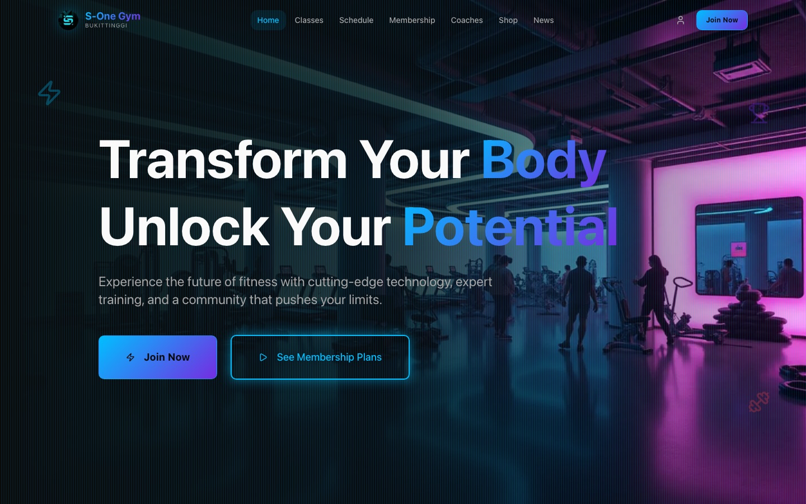
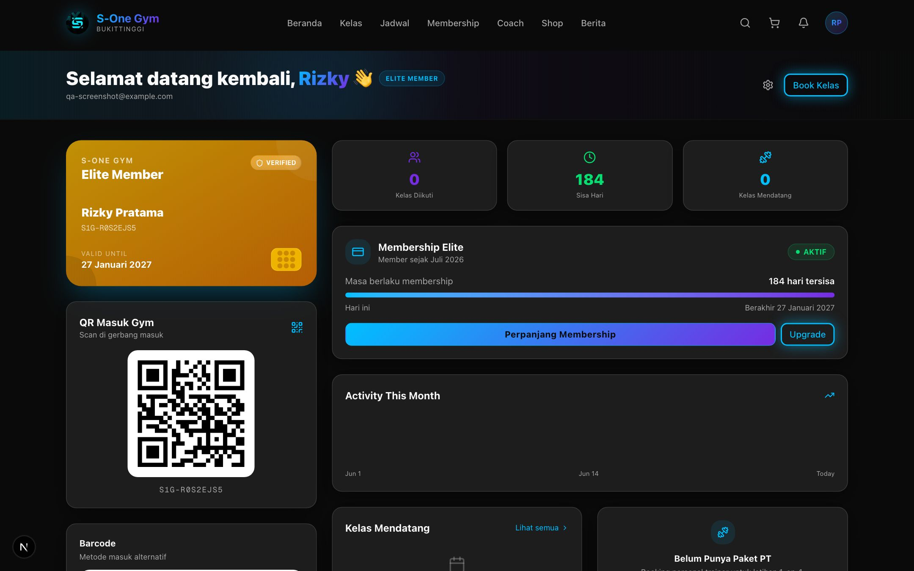
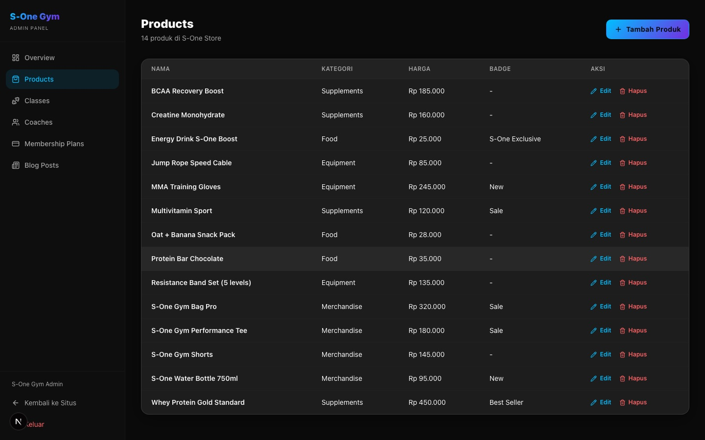
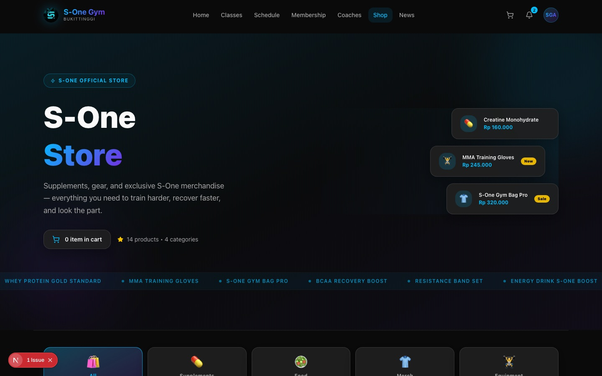
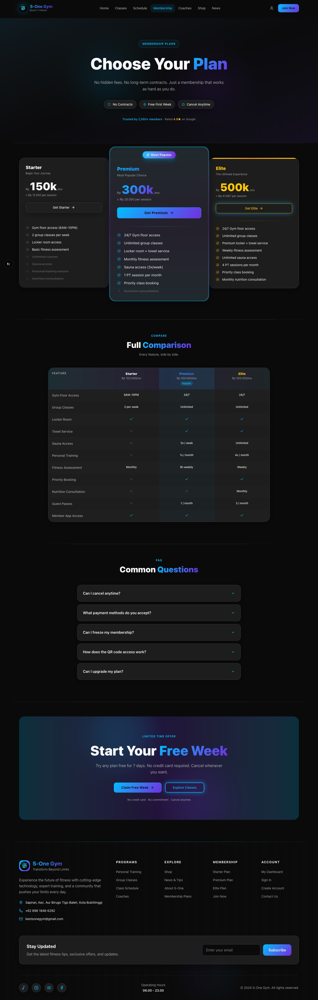
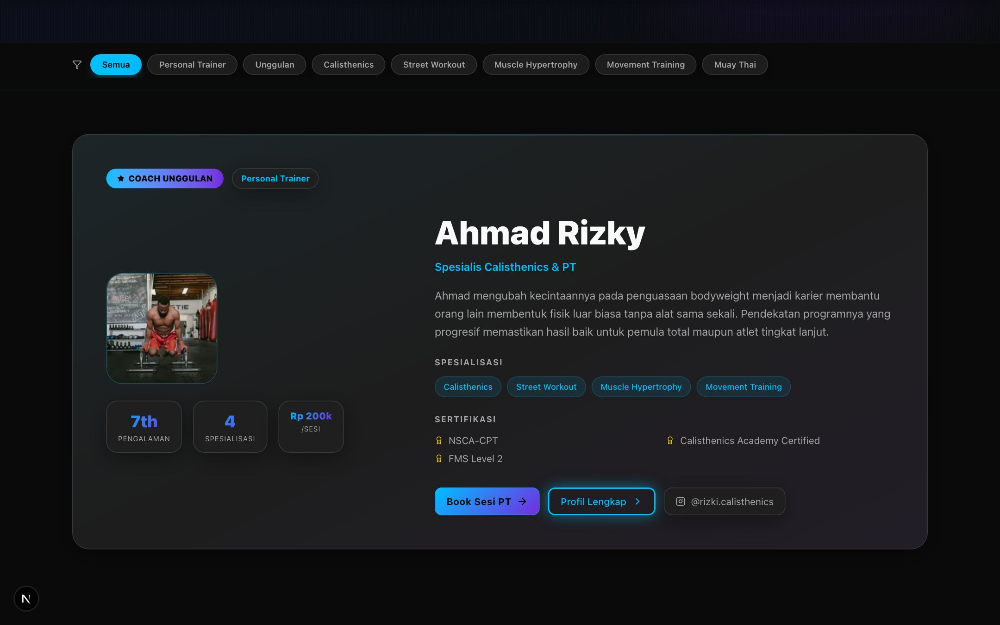
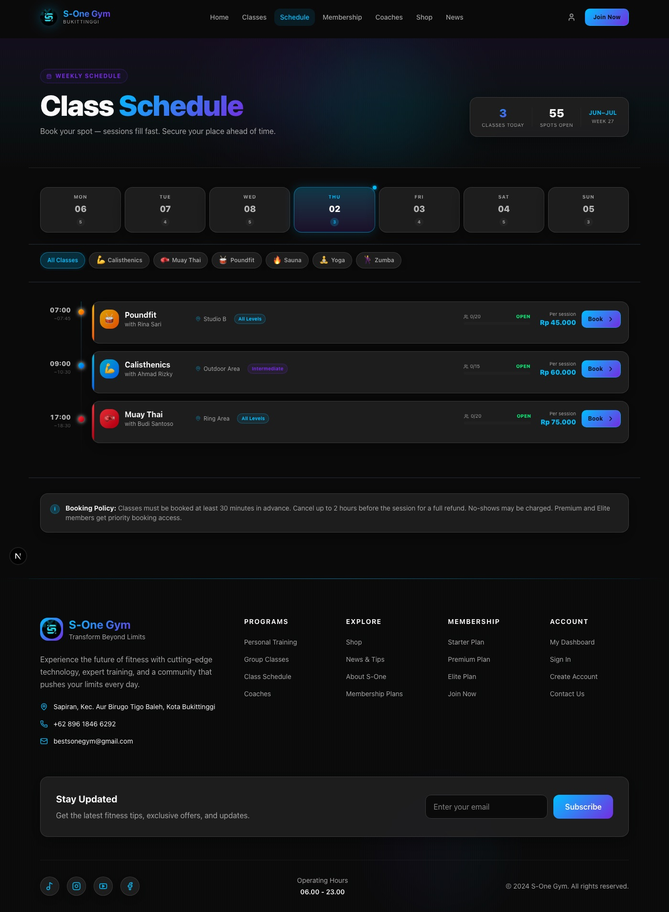

<div align="center">

# S-One Gym — Full-Stack Gym Management Platform

Sebuah aplikasi web full-stack untuk gym fiktif di Bukittinggi: situs publik, akun member, dan panel admin CMS — dibangun dari nol dengan Next.js 15, Prisma, dan PostgreSQL.


</div>



## Overview

S-One Gym adalah aplikasi manajemen gym full-stack yang mencakup tiga sisi sekaligus:

- **Situs publik** — landing page, katalog kelas, jadwal mingguan, profil coach, paket membership, toko produk, dan blog/news — semua datanya diambil langsung dari database, bukan data statis.
- **Area member** — registrasi & login sungguhan (bukan simulasi), dashboard dengan QR/barcode entry, status membership, riwayat transaksi, dan booking kelas.
- **Panel admin (CMS)** — dilindungi role-based access control, dipakai untuk mengelola seluruh konten publik (produk, kelas, coach, paket membership, artikel) langsung dari browser tanpa menyentuh database secara manual.

Project ini sengaja dibangun bertahap dari static mock UI menjadi aplikasi full-stack yang benar-benar tersambung ke database — termasuk menemukan dan memperbaiki beberapa bug non-trivial di sepanjang jalan (lihat bagian [Engineering Highlights](#engineering-highlights)).

## Fitur Utama

### Publik
- Homepage dengan section dinamis (kelas unggulan, coach unggulan, artikel terbaru) yang otomatis menyesuaikan jumlah data
- Katalog kelas dengan filter level & detail jadwal per kelas
- Jadwal mingguan dengan filter hari + tipe kelas
- Direktori coach & alur booking Personal Trainer
- Paket membership dengan tabel perbandingan fitur
- Toko produk dengan keranjang belanja (floating cart button + feedback toast saat add-to-cart)
- Blog/News dengan halaman detail artikel

### Member (Auth)
- Registrasi & login dengan **NextAuth v5 (Credentials Provider)** + password di-hash pakai `bcrypt-ts`
- Pemilihan/penggantian paket membership yang benar-benar tersimpan ke database (bukan sekadar UI)
- Dashboard member: kartu QR/barcode entry, status membership aktif, grafik aktivitas, transaksi terbaru, kelas mendatang
- Middleware route-protection untuk halaman yang butuh login

### Admin CMS
- Login admin dengan role terpisah (`ADMIN` vs `USER`), dijaga di level middleware **dan** layout
- CRUD penuh untuk **Products**, **Classes**, **Coaches**, **Membership Plans**, dan **Blog Posts**
- Dibangun dengan **Next.js Server Actions** (bukan REST API terpisah) untuk mutasi data — lebih sedikit boilerplate, validasi tetap jalan di server

## Screenshot

| Dashboard Member | Panel Admin |
|---|---|
|  |  |

| Shop | Membership |
|---|---|
|  |  |

| Coaches | Schedule |
|---|---|
|  |  |

## Tech Stack

| Layer | Teknologi |
|---|---|
| Framework | [Next.js 15](https://nextjs.org) (App Router, Turbopack, Server Components + Server Actions) |
| Bahasa | TypeScript |
| Styling | Tailwind CSS v4, custom design system (glass morphism + neon accent) |
| Database | PostgreSQL ([Supabase](https://supabase.com)) |
| ORM | [Prisma](https://www.prisma.io) |
| Autentikasi | [NextAuth v5](https://authjs.dev) (Credentials Provider) + `bcrypt-ts` |
| Validasi | [Zod](https://zod.dev) |
| Komponen UI | Radix UI primitives, `lucide-react`, `class-variance-authority` |

## Arsitektur

Struktur folder mengikuti pola **Atomic Design**:

```
src/
├── app/                # Routes (App Router) — public pages, /admin, /api
├── components/
│   ├── atoms/          # Elemen terkecil (button, input, icon visual)
│   ├── molecules/      # Gabungan atom (card, form field, widget kecil)
│   ├── organisms/      # Bagian halaman lengkap (header, section, sidebar)
│   ├── templates/      # Layout pembungkus halaman
│   ├── ui/             # Base UI primitives (input, select, textarea, label)
│   └── admin/          # Komponen khusus panel admin (table, delete button)
├── context/            # React Context (Cart)
├── lib/                # Prisma client, auth config, serializer helper
└── generated/prisma/   # Prisma Client hasil generate (gitignored)
prisma/
├── schema.prisma       # Skema database
├── seed.ts             # Seed data awal
└── migrations/         # Riwayat migrasi
```

**Kenapa Server Actions untuk admin, tapi REST API untuk data publik?**
Endpoint publik (`/api/products`, `/api/coaches`, dst.) tetap dibuat sebagai REST API karena dikonsumsi oleh client component yang butuh fetch di sisi browser. Sedangkan mutasi di panel admin (create/update/delete) pakai Server Actions karena semuanya jalan di Server Component tanpa perlu round-trip fetch manual, dan validasi role tetap dicek ulang di server sebagai lapisan pertahanan kedua di luar middleware.

## Menjalankan Secara Lokal

### 1. Clone & install

```bash
git clone https://github.com/RizqGyx/ecommerce-auth.git
cd ecommerce-auth
npm install
```

### 2. Environment variables

Salin `.env.example` menjadi `.env.local`, lalu isi:

```env
AUTH_SECRET=            # generate dengan: openssl rand -base64 32
DATABASE_URL=           # connection string PostgreSQL (pooler)
DIRECT_URL=             # connection string PostgreSQL (direct, untuk migrasi)
NEXT_PUBLIC_SUPABASE_URL=
NEXT_PUBLIC_SUPABASE_PUBLISHABLE_KEY=
```

### 3. Setup database

```bash
npm run prisma:generate   # generate Prisma Client
npm run prisma:migrate    # jalankan migrasi
npm run prisma:seed       # isi data awal (produk, kelas, coach, dll)
```

Seed script otomatis membuat 1 akun admin untuk login ke panel admin:

```
Email    : admin@s-onegym.id
Password : admin123
```

### 4. Jalankan development server

```bash
npm run dev
```

Buka [http://localhost:3000](http://localhost:3000). Panel admin ada di `/admin` (login dengan akun admin di atas).
